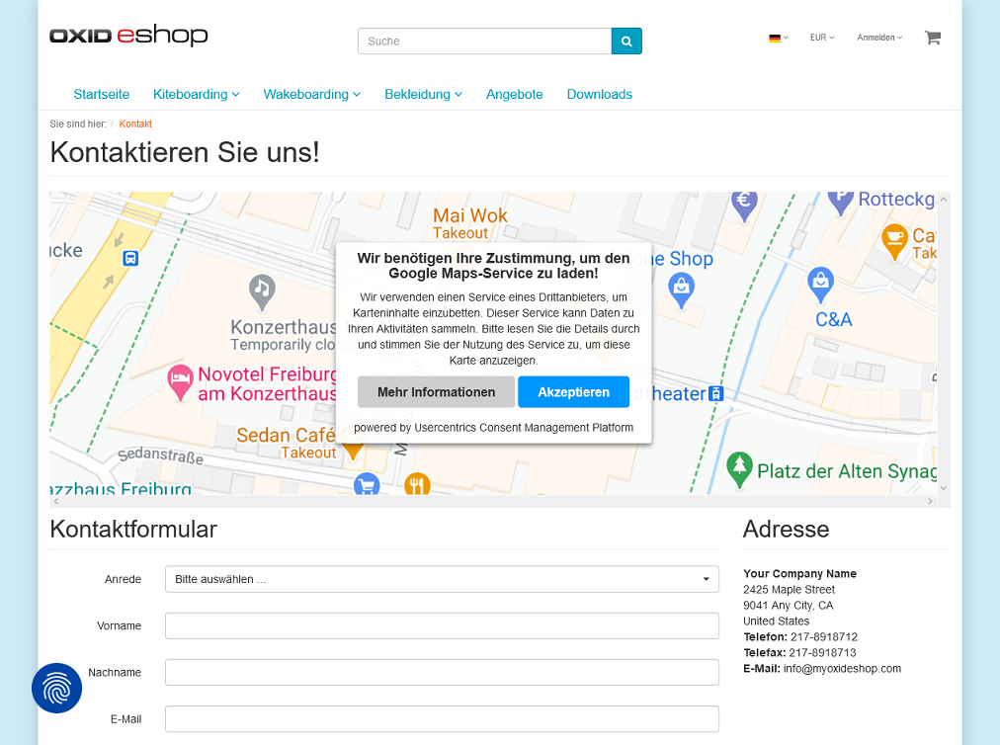

Funktionsbeschreibung
=====================

Die Funktionen, die das Modul OXID Cookie Management bereitstellt, werden im Frontend des Shops verwendet.

Den Besuchern des Shops wird jeweils beim ersten Aufruf ein Banner "Privatsphären-Einstellungen" angezeigt, welches darüber informiert, dass Website-Tracking-Technologien von Drittanbietern verwendet werden.

Diese dienen dazu, Dienste bereitzustellen und ggf. Werbung entsprechend den Interessen der Benutzer anzuzeigen.

Der Benutzer kann alle Einstellungen akzeptieren, ablehnen oder sie im Detail anschauen und verändern.

Die Zustimmung oder Ablehnung des Benutzers wird lokal gespeichert.

Nachträgliche Anpassungen sind jederzeit möglich, indem über eine stets sichtbare Schaltfläche die Datenschutzeinstellungen erneut aufgerufen werden können.

Die Consent Management Platform gibt es in einer Version 1 und 2, welche sich in Funktion, Layout und Browserunterstützung voneinander unterscheiden. Diese Funktionsbeschreibung informiert über CMP Version 2.

Erster Aufruf des Shops
-----------------------
Beim allerersten Aufruf des OXID eShop wird dem Benutzer standardmäßig ein Banner angezeigt, auf dem er allen Privatsphäre-Einstellungen zustimmen, diese ablehnen oder nach seinen Vorgaben anpassen kann. 

Bei den Datenschutzeinstellungen wird zwischen den Kategorien "Essenziell", "Funktional" und "Marketing" unterschieden. Nur die Datenschutzeinstellungen der Kategorie "Essenziell" sind voreingestellt und können auch nicht deaktiviert werden.

Die Kategorien "Funktional" und "Marketing" enthalten Einstellungen, welche der Benutzer explizit aktivieren muss.

Wählt der Benutzer den schnellen Weg über die Schaltfläche :guilabel:`Alles akzeptieren`, sind damit sämtliche Datenschutzeinstellungen aktiv.

Datenschutzeinstellungen anzeigen und ändern
--------------------------------------------
In einem separaten Fenster kann der Benutzer des OXID eShop detaillierte Informationen über die integrierten Datenverarbeitungsdienste und Kategorien einsehen.

Die Datenschutzeinstellungen sind über eine jederzeit im Shop sichtbare Schaltfäche aufrufbar, welche einen symbolischen Fingerabdruck zeigt. Hier können die Einstellungen geprüft und geändert werden. 

Spätere Zustimmung
------------------
Smart Data Protector ist ein Dienst, der dafür sorgt, dass Technologien von Drittanbietern nur ausgeführt werden, wenn der Benutzer diesen in den Datenschutzeinstellungen ausdrücklich zugestimmt hat.

Hat ein Benutzer beispielsweise die Verwendung von Google Maps nicht aktiviert, dann wird bei Aufruf des Kontaktformulars kein interaktiver Kartenausschnitt angezeigt und die Zustimmung des Benutzers erneut abgefragt.

Auch Dienste, die in der Consent Management Platform nicht konfiguriert wurden, werden durch den Smart Data Protector blockiert.

.. Intern: oxdajn, Status: