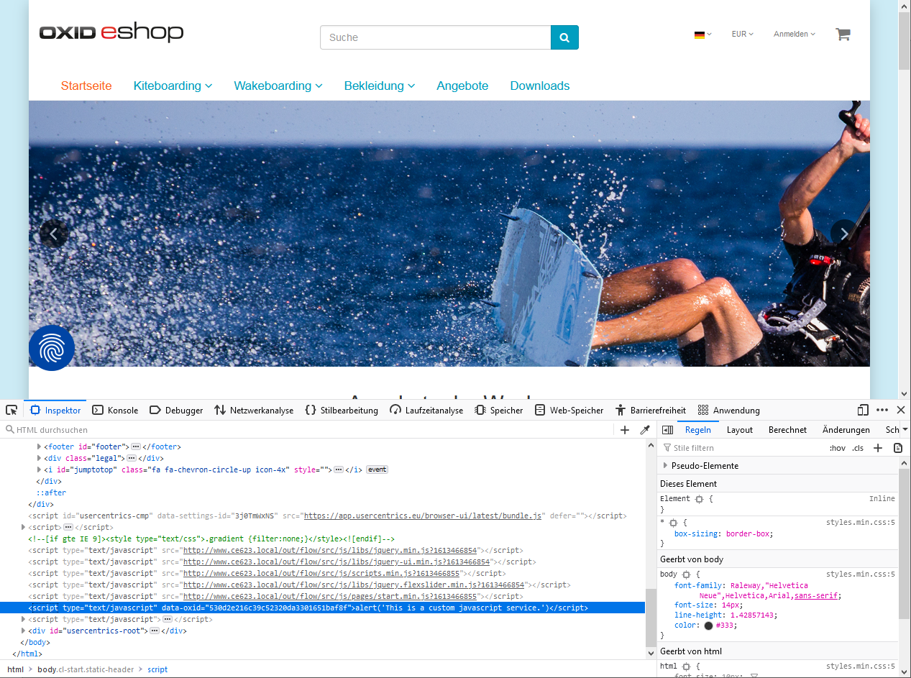
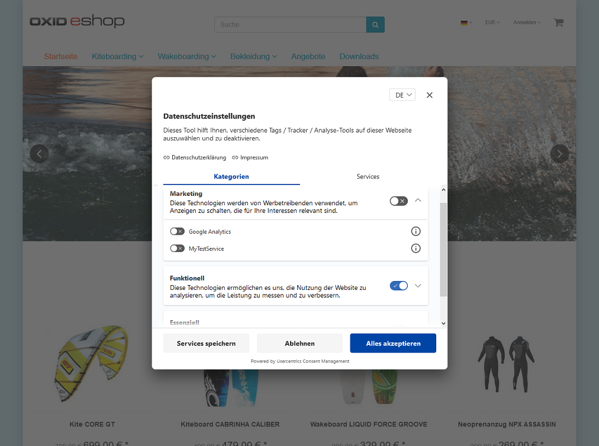

Benutzerdefinierte Dienste integrieren
======================================

Usercentrics hat eine Datenbank mit vordefinierten Datenverarbeitungsdiensten.

Diese enthalten eine kurze Beschreibung des Dienstes sowie weitere gesetzlich vorgeschriebene Informationen.

Wenn Sie in Ihrem OXID eShop einen Dienst verwenden, der nicht in dieser Datenbank vorhanden ist, konfigurieren Sie den Dienst in Ihrem OXID eShop und legen ihn im Usercentrics Admin Interface als benutzerdefinierten Dienst an.

Konfiguration des Dienstes im OXID eShop
----------------------------------------
Ein benutzerdefinierter Dienst erfordert eine Datei :file:`usercentrics.yaml`, welche im Ordner :file:`/oxideshop/var/configuration/` gespeichert wurde. Das Beispiel zeigt den Aufbau dieser Datei für den benutzerdefinierten Dienst "MyTestService".

.. code:: yaml

  services:
    - { name: MyTestService, id: MyTestServiceId }
  scriptSnippets:
    - { service: MyTestServiceId, id: '530d2e216c39c52320da3301651baf8f' }
  scripts:
    - { service: MyTestServiceId, path: js/libs/test.js }

``services`` 
  nimmt den Namem des benutzerdefinierten Dienstes auf, wie er im UserCentrics Admin Interface definiert werden muss. 

``scriptSnippets`` 
  ist für die Verwendung von add-Kommandos. Beispiel:

.. code:: javascript

   [{oxscript add="alert('This is a custom javascript service.')" }]

Um den Hash für ein Snippet zu erhalten, fügen Sie das Snippet einer Seite des Shops hinzu und rufen Sie diese im Browser auf. Über die Tools für Web-Entwickler können Sie jetzt auf den Wert des data-oxid-Attributs zugreifen.

``scripts`` 
  wird für das Einbinden von JavaScript-Dateien verwendet. Beispiel: 

.. code:: javascript

  [{oxscript include="js/libs/test.js"}]

---------------------------------------------------------------------------------------------------

Anlegen des Dienstes im UserCentrics Admin Interface
----------------------------------------------------
Der Dienst wird nun im UserCentrics Admin Interface definiert.

Legen Sie den Dienst dort im Abschnitt :guilabel:`Service Settings` unter :guilabel:`Data Processing Services` an.

Verwenden Sie dafür :guilabel:`Create Custom Service`.

Der Dienst wird von diesem Zeitpunkt an in den Datenschutzeinstellungen angezeigt und erfordert die Zustimmung des Benutzers.

.. Intern: oxdajo, Status: