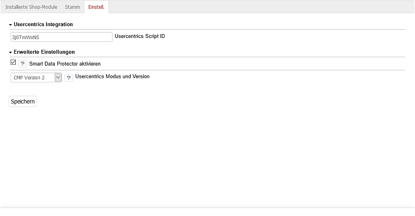
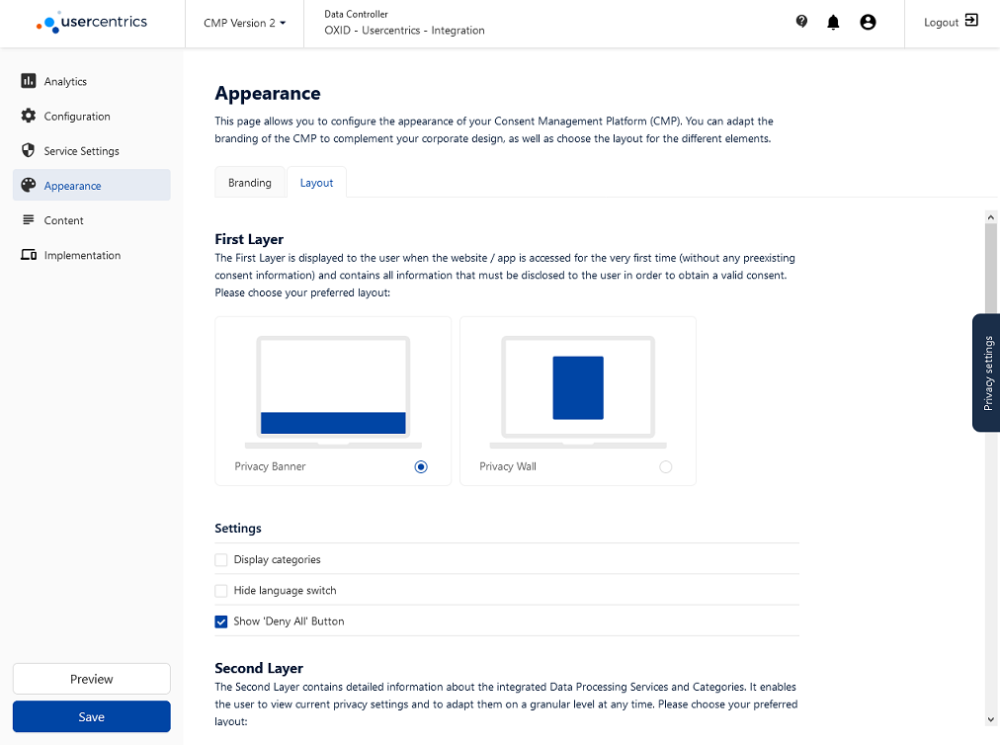

Konfiguration
=============

Installation
------------

**OXID Cookie Management powered by usercentrics** 2.0 is shipped with OXID eShop 7.0 by default.

You don't need to install the module, you can start configuring it right away.

Konfiguration des Moduls
------------------------
Die Funktionen des Moduls lassen sich in dessen Einstellungen konfigurieren. Gehen Sie dafür im Administrationsbereich zu :menuselection:`Erweiterungen --> Module` und wählen Sie das  Modul OXID Cookie Management aus der Liste der Module. Sie finden die Einstellungen auf der Registerkarte :guilabel:`Einstell.`

Usercentrics Integration
^^^^^^^^^^^^^^^^^^^^^^^^
Die wichtigste Moduleinstellung ist die Usercentrics Script ID. Um Ihren OXID eShop mit der Usercentrics Consent Management Platform (CMP) zu verbinden, tragen Sie hier bitte den Wert ein, den Sie im Usercentrics Admin Interface finden. Er wird Ihnen nach dem Login als Setting-ID zu Ihrer Domain angezeigt.

Erweiterte Einstellungen
^^^^^^^^^^^^^^^^^^^^^^^^
Die Einstellungen in diesem Abschnitt sollten in der Regel nicht geändert werden. Der Smart Data Protector ist ein Dienst, der Technologien und Dienste von Drittanbietern überwacht. Diese werden nur ausgeführt, wenn der Benutzer diesen in den Datenschutzeinstellungen ausdrücklich zugestimmt hat. Wird im OXID eShop eine Seite aufgerufen, die eine solche Technologie verwendet und der Benutzer hat diese nicht akzeptiert, wird dessen Zustimmung erneut abgefragt. Erst nachdem der Benutzer zugestimmt hat, wird der entsprechende Dienst ausgeführt. Smart Data Protector ist standardmäßig aktiv.

Bei Usercentrics Modus und Version ist CMP Version 2 als Standard ausgewählt. Damit arbeitet das Modul mit der aktuellen Version der Consent Management Platform. Diese unterscheidet sich von der Vorgängerversion in Funktion, Layout und Browserunterstützung. Detaillierte Informationen zu den weiteren Modi und Versionen entnehmen Sie bitte der `Usercentrics Dokumentation <https://docs.usercentrics.com>`_.

Kann Ihr Shop aufgrund von speziellen Anpassungen nicht auf die Usercentrics Integration des Moduls zurückgreifen, muss das Code Snippet (JavaScript Tag) eigenständig implementiert werden. In diesem Fall wählen Sie :guilabel:`Usercentrics Script selbst einbinden` aus der Dropdownliste.

---------------------------------------------------------------------------------------------------

Konfiguration im Usercentrics Admin Interface
---------------------------------------------
Um die Funktionen des Moduls nutzen zu können, müssen Sie sich bei Usercentrics registrieren und eines für Ihren OXID eShop passendes Paket erwerben. Verwenden Sie dafür den Link https://usercentrics.com/de/preise/?partnerid=16967#business-paket.

Das Usercentrics Admin Interface, welches über den Link https://admin.usercentrics.com aufgerufen wird, hat eine intuitiv bedienbare Benutzeroberfläche. 

Unter :guilabel:`General` werden die Inhalte, Texte und Links festgelegt, die dem Benutzer im Shop angezeigt werden.  Bitte stellen Sie sicher, dass die Angaben rechtskonform sind.

Für einen OXID eShop im Standard müssen mindestens diese Datenverarbeitungsdienste im Abschnitt :guilabel:`Data Processing Services` in den :guilabel:`Service Settings` angelegt werden: 

* OXID eShop als Basis-Datenverarbeitungsdienst
* Zahlungsanbieter, die im Shop verwendet werden, beispielsweise PayPal
* Hoster des Shops, beispielsweise OXID Cloud
* Google Maps für die Anzeige der Karte im Kontaktformular
* Google Analytics für die Webanalyse der Shopnutzung
* Datenverarbeitungsdienste für weitere Dienstleister, beispielsweise Suchanbieter
  
Verwenden Sie dafür :guilabel:`Add Data Processing Service via Database`, um die Dienste aus der Datenbank auszuwählen. Ergänzen Sie gegebenfalls spezielle, in Ihrem Shop verwendete Dienste, wie beispielsweise solche für die Bezahlmethoden, eingesetzte Suchmaschinen oder Lösungen für Produktempfehlungen. Für alle Dienste empfiehlt es sich, deren Beschreibung zu prüfen und die Texte ggf. für den eigenen Shop anzupassen.

Wie die Datenschutzeinstellungen im OXID eShop angezeigt werden, lässt sich unter :guilabel:`Appearance` festlegen. Die Einstellungen reichen von der Farbpalette und der Schriftart und -größe bis zum Layout für die Datenschutzeinstellungen und das Aussehen des permanenten Icons im Shop.

Falls Sie Hilfe bei der Konfiguration der Consent Management Platform benötigen, nutzen Sie bitte die durch Usercentrics bereitgestellten Ressourcen, wie Videos oder Dokumentation. Auch das Usercentrics Customer Success-Team und geschulte Partner stehen bereit, um Sie bei der Konfiguration zu unterstützen.

.. Intern: oxdajm, Status: